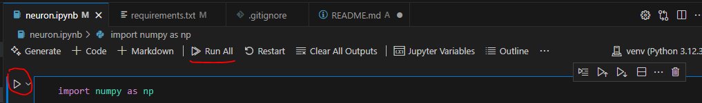

# BasicNeuron

Este é um projeto simples de neurônio artificial implementado em Python, com foco em aprendizado do algoritmo Perceptron.

## ⚙️ Pré-requisitos

- Python 3.7 ou superior
- Git (opcional, mas recomendado para clonar o repositório)

## 🐍 Criando um ambiente virtual

Você pode usar o `venv`, que já vem com o Python.

### No Linux/macOS:

```bash
python3 -m venv venv
source venv/bin/activate
```

No Windows (CMD ou PowerShell):

```bash
python -m venv venv
venv\Scripts\activate
```

Após ativar, você verá (venv) no começo da linha de comando.

## 📦 Instalando dependências
Este projeto usa apenas o numpy. Instale com o seguinte comando:

```bash
pip install -r requirements.txt
```
Se o arquivo requirements.txt ainda não existir, você pode instalar manualmente:

```bash 
pip install numpy
```
E depois criar o arquivo com:

```bash
pip freeze > requirements.txt
```

## 🚀 Executando o projeto
Após instalar as dependências basta rodar através do seu editor:



Certifique-se de que os arquivos data.txt e test.txt estejam no diretório correto (por padrão, sample_data/).

## 📁 Estrutura esperada do projeto
```bash
BasicNeuron/
├── neuron.ipynb
├── requirements.txt
└── sample_data/
    ├── data.txt
    └── test.txt
```
## ❌ Desativando o ambiente virtual
Linux/macOS ou Windows:
```bash
deactivate
```